# <p align="center">NexTalk — Premium Messaging Experience</p>

<p align="center">
  
  
  
  
  
</p>

<p align="center">
  <b>NexTalk</b> is a sophisticated, real-time messaging ecosystem designed with <b>Premium Aesthetics</b> and <b>High-Performance Architecture</b>. Featuring a clean Indigo-branded UI, Glassmorphism elements, and smooth micro-animations, it provides a truly elite communication experience.
</p>

---

## 📱 Visual Showcase

### ✨ Elegant Onboarding
Explore the fluid first-time experience that welcomes our premium users.

<table width="100%">
  <tr>
    <td width="33%">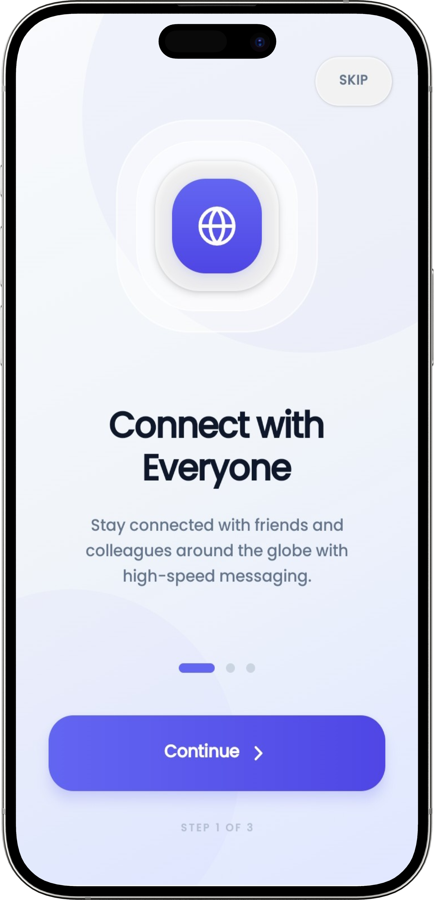</td>
    <td width="33%">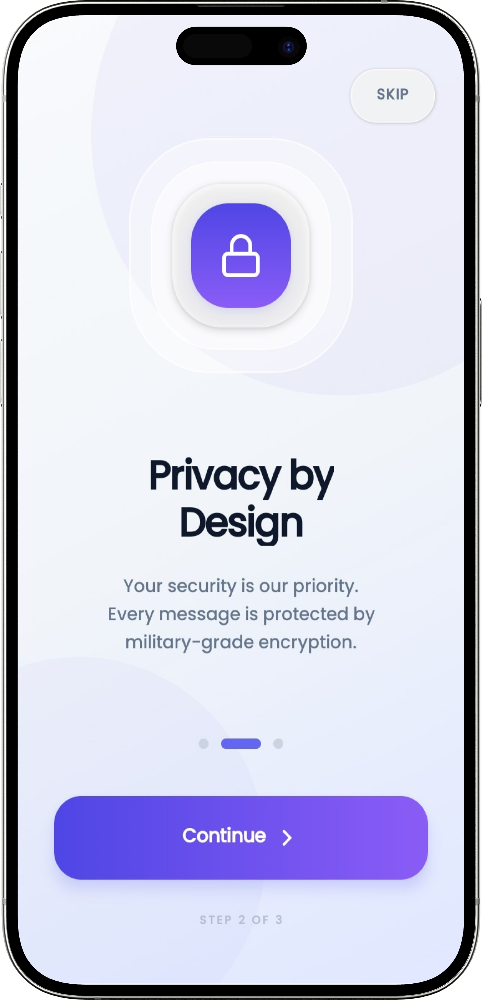</td>
    <td width="33%">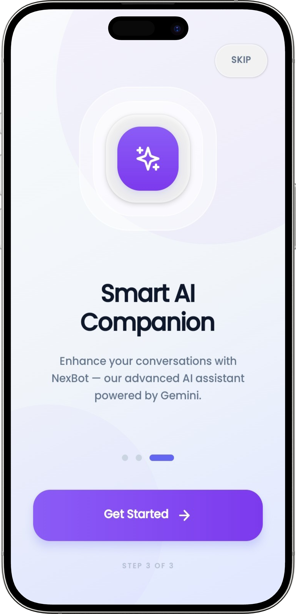</td>
  </tr>
  <tr align="center">
    <td><b>Connect Globally</b></td>
    <td><b>Privacy First</b></td>
    <td><b>AI Powered</b></td>
  </tr>
</table>

### 🔐 Authentication Flow
Unified branding across Login and Registration screens for a seamless start.

<table width="100%">
  <tr>
    <td width="50%">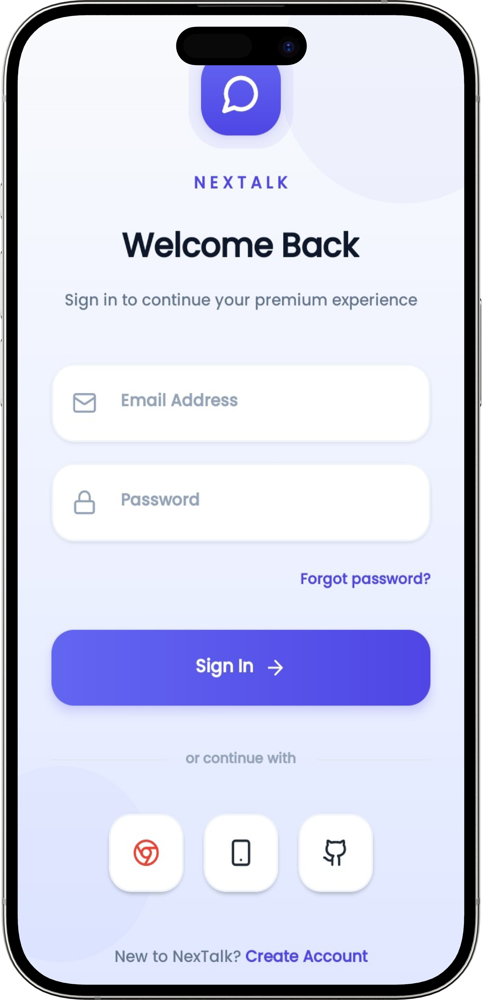</td>
    <td width="50%">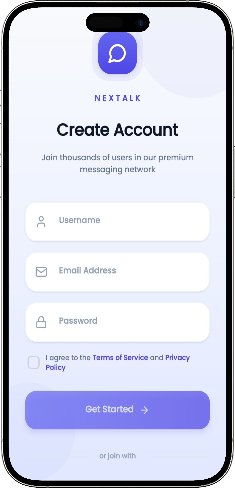</td>
  </tr>
  <tr align="center">
    <td><b>Premium Sign In</b></td>
    <td><b>Instant Registration</b></td>
  </tr>
</table>

### 💬 Messaging & Real-Time Interaction
Experience the pinnacle of chat design with support for group conversations and high-fidelity messaging.

<table width="100%">
  <tr>
    <td width="33%">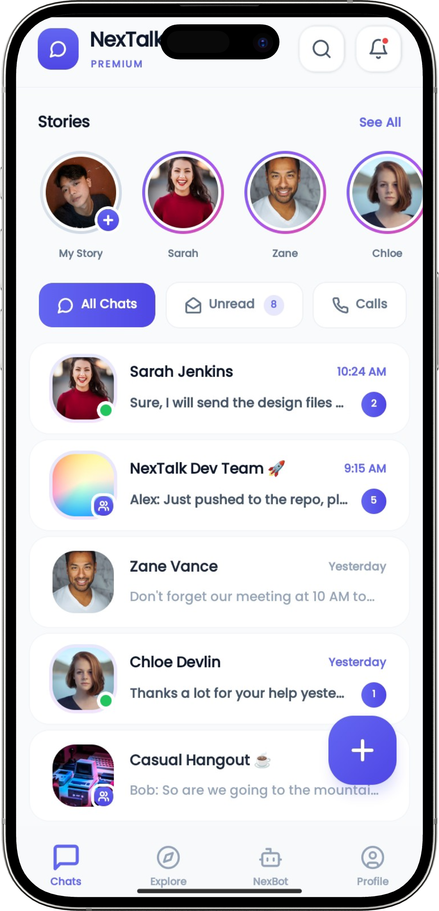</td>
    <td width="33%">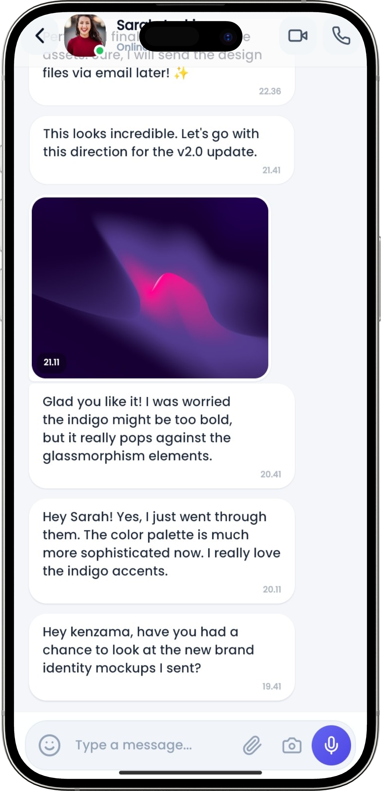</td>
    <td width="33%">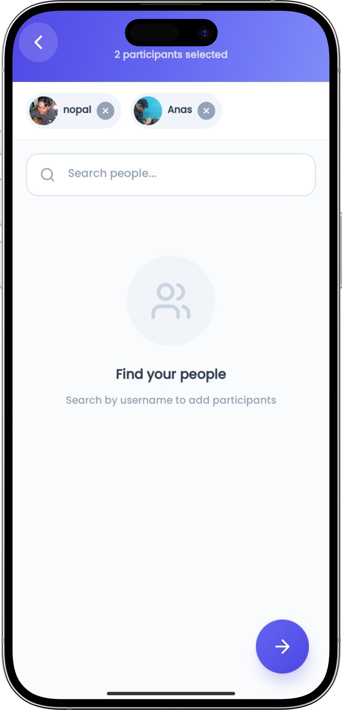</td>
  </tr>
  <tr align="center">
    <td><b>Main Chat Hub</b></td>
    <td><b>Fluid Chat Room</b></td>
    <td><b>Interactive Groups</b></td>
  </tr>
</table>

### 🤖 NexBot AI & Call History
Integrated AI companionship and professional-grade call logging.

<table width="100%">
  <tr>
    <td width="50%">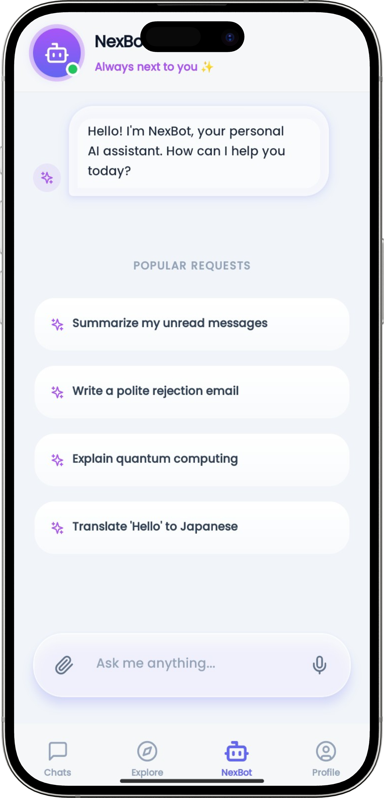</td>
    <td width="50%">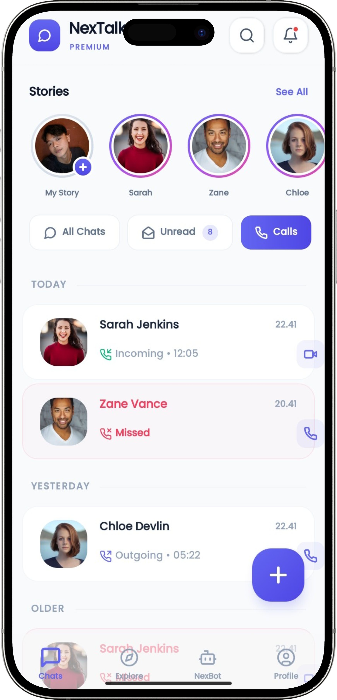</td>
  </tr>
  <tr align="center">
    <td><b>Smart AI Assistant</b></td>
    <td><b>Organized Call History</b></td>
  </tr>
</table>

### 🌈 Moments & Discovery
Stay updated with high-end story interactions and a dynamic discovery explorer.

<table width="100%">
  <tr>
    <td width="50%">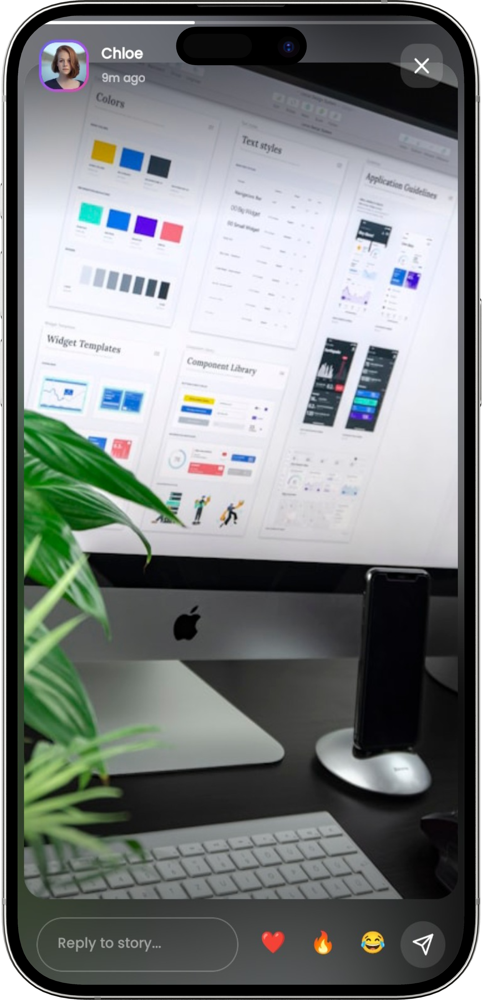</td>
    <td width="50%">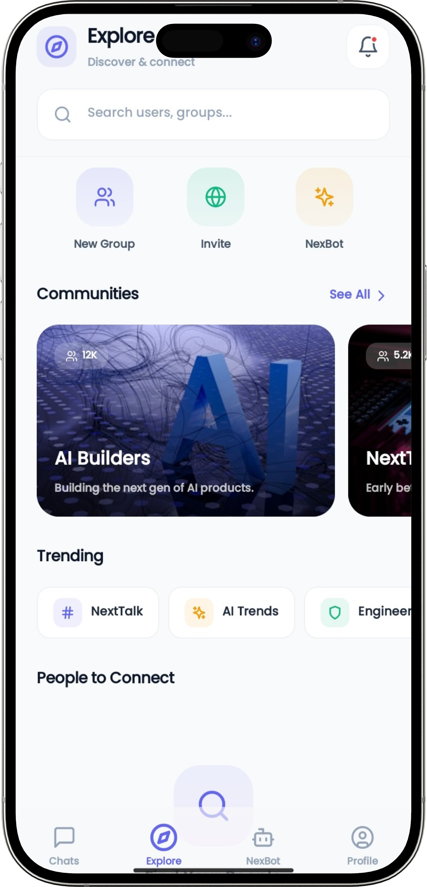</td>
  </tr>
  <tr align="center">
    <td><b>Interactive Stories</b></td>
    <td><b>Connect & Explore</b></td>
  </tr>
</table>

---

## 🚀 Key Features

- **💎 Elite Design Language**: Deep Indigo hues, layered transparency, and sophisticated typography.
- **⚡ High-Speed Messaging**: Real-time logic built on Gorilla WebSockets for ultra-low latency.
- **🛡️ Secure Communication**: End-to-end feel with session-based authentication (JWT).
- **🗣️ Advanced AI Integration**: Meet NexBot—your companion for smart replies and instant knowledge.
- **📊 Professional History**: Smart date grouping for calls (Today, Yesterday, Earlier).
- **🌐 Scalable Backend**: Fiber (Golang) middleware management for high-concurrency handling.

## 🛠 Tech Stack

| Module | Technologies |
|---|---|
| **Frontend** | React Native, Expo, Zustand, Lucide Icons, Reanimated |
| **Backend** | Golang, Fiber Framework, Gorilla WebSocket |
| **Database** | PostgreSQL with GORM |
| **Cache** | Redis for state management |
| **Cloud** | Cloudinary for media uploads |

## ⚙️ Installation & Setup

1. **Spin up Infrastructure**
   ```bash
   docker-compose up -d
   ```

2. **Configure Backend**
   ```bash
   cd backend && go mod download
   # Update .env with your PostgreSQL & Redis URLs
   go run cmd/api/main.go
   ```

3. **Launch Mobile**
   ```bash
   cd mobile && npm install
   npx expo start
   ```

---
<p align="center">Built with passion by <b>Your Name</b></p>
